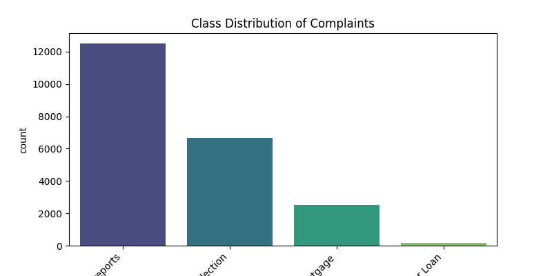
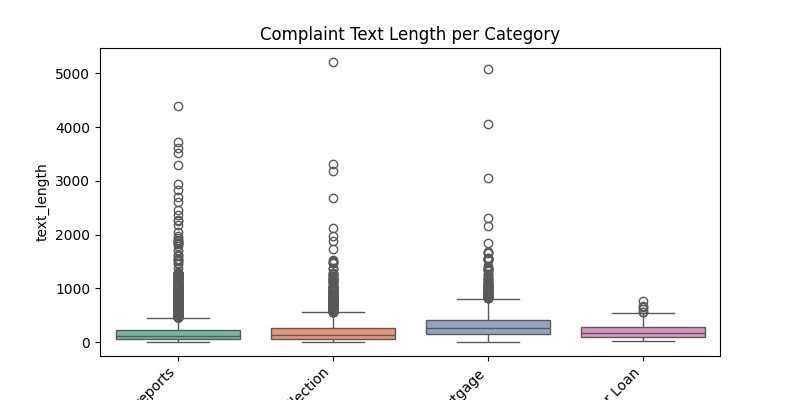
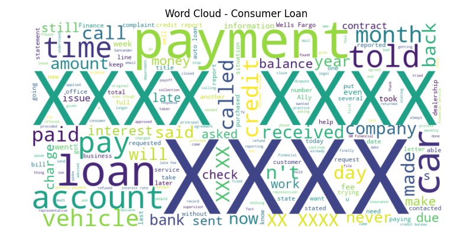
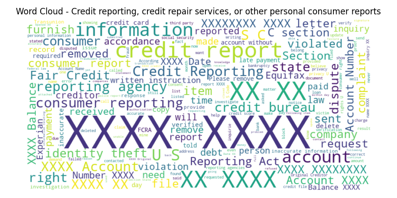
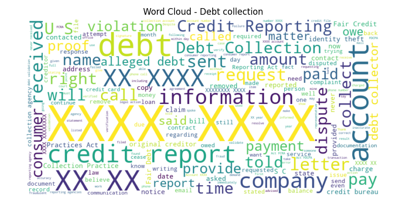
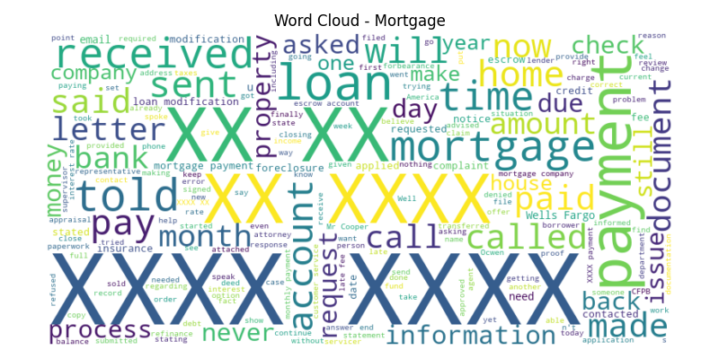
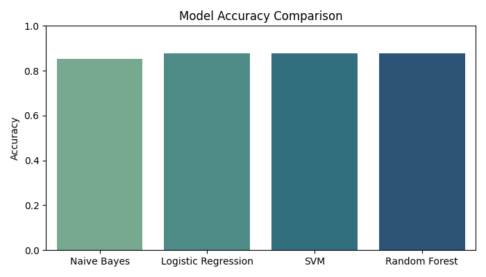
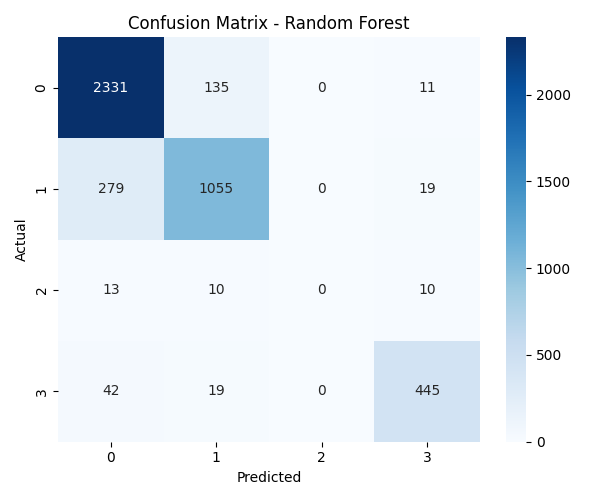

# 🧠 Kaiburr Assessment 2025 – Task 5
### Multi-Class Text Classification on Consumer Complaints


---

## 📘 Project Overview

This project performs **multi-class text classification** on the Consumer Complaint Database. The primary goal is to categorize consumer complaints into one of four financial product categories based on the narrative text.

The model is trained to classify complaints into the following target labels:

| Label | Category                                       |
| :---: | :--------------------------------------------- |
|   0   | Credit reporting, repair, or other services    |
|   1   | Debt collection                                |
|   2   | Consumer Loan                                  |
|   3   | Mortgage                                       |

---

## 📊 Exploratory Data Analysis (EDA)

Before modeling, a thorough EDA was conducted to understand the dataset's characteristics.

### Class Distribution
The distribution of samples across the four categories was analyzed to check for imbalances. The "Debt collection" and "Credit reporting" classes are the most frequent.



### Text Length Analysis
A boxplot was used to examine the length of complaint narratives for each category, revealing patterns in verbosity.



### Word Clouds
Word clouds were generated for each category to visualize the most prominent terms after text pre-processing (stopwords removal and lemmatization).

| Consumer Loan                                       | Credit Reporting & Repair                               |
| :--------------------------------------------------: | :----------------------------------------------------------: |
|  |  |
| **Debt Collection** | **Mortgage** |
|  |        |

---

## 🤖 Model Training & Evaluation

Several classification models were trained and compared to identify the best-performing one.

### Model Comparison
Four different models were evaluated based on their accuracy scores. **Random Forest** demonstrated the highest performance.



### Best Model Performance
The confusion matrix for the best model (Random Forest) provides a detailed look at its predictive accuracy across all classes.



---

## 🏆 Performance Summary

-   **Best Model**: **Random Forest**
-   **Overall Accuracy**: Approximately **88%**
-   **Key Insight**: The model performs very well, but metrics for the "Consumer Loan" class are less stable due to a significantly lower number of samples in the training data.

---

## 🚀 How to Run

### Prerequisites
-   Python 3.8+
-   `pip` and `venv`

### Setup & Execution
Follow these steps to set up the environment and run the project.

```bash
# 1. Clone the repository
git clone [https://github.com/ajithabhiram/kaiburr-task5.git](https://github.com/ajithabhiram/kaiburr-task5.git)
cd kaiburr-task5

# 2. (Optional but recommended) Create and activate a virtual environment
python -m venv venv
venv\Scripts\activate

# For macOS/Linux, use: source venv/bin/activate

# 3. Install the required packages
pip install -r requirements.txt

# 4. Run the main script
python main.py
